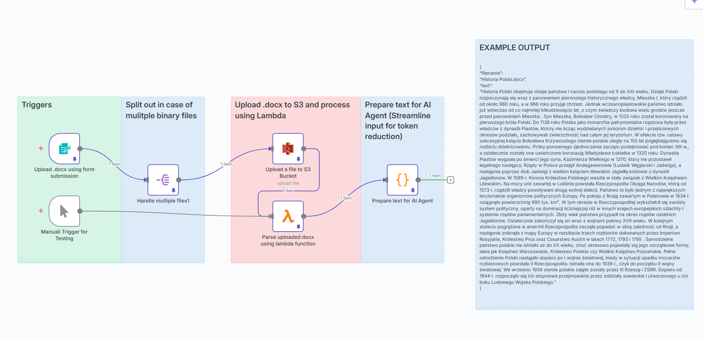

## Parse DOCX with AWS Lambda & S3

This repository provides an automated workflow to upload .docx files to AWS S3, process them via an AWS Lambda function, and return clean, structured text ready for use in downstream applications (e.g., AI agents, NLP pipelines, or databases). The workflow is implemented with n8n and leverages AWS services for scalability and reliability.

## Workflow Screenshot



## Features
File Upload via Form – Users can upload .docx files through a simple web form.
S3 Storage – Files are securely stored in an AWS S3 bucket.
Lambda Parsing – AWS Lambda extracts and parses text from .docx.
Text Cleaning – Removes references, redundant whitespace, and unwanted symbols while preserving formatting.
AI-Ready Output – Produces lightweight, clean text optimized for tokenization.
Manual Trigger Support – Useful for testing the workflow without the form.

## Workflow Overview

```mermaid
flowchart TD
    A[Upload DOCX] --> B[S3 Storage]
    B --> C[Lambda Parser]
    C --> D[Text Cleaner]
    D --> E[AI Agent Ready Text]
